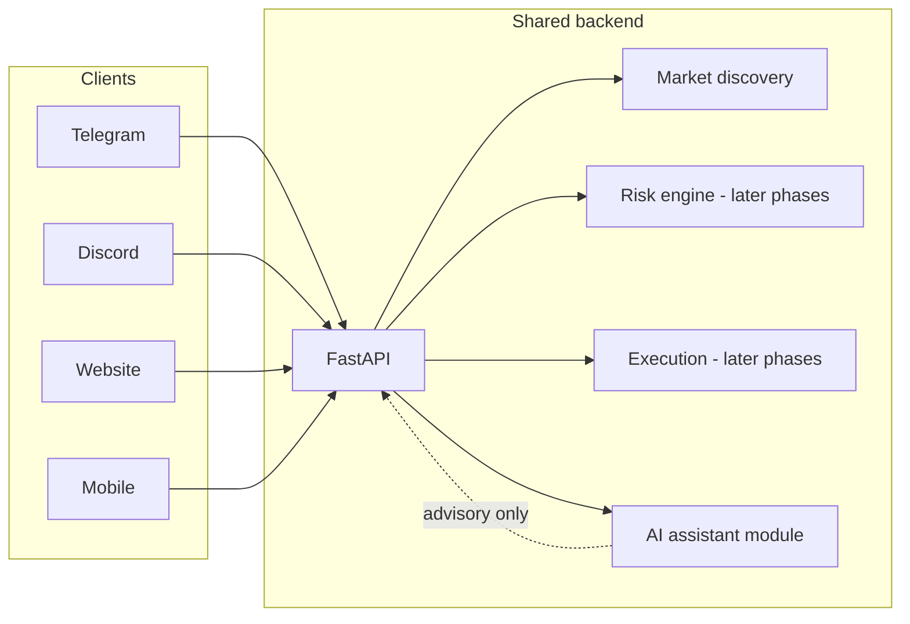

# Polymarket AI-assisted trading platform

Monorepo for a **shared backend** and **four frontends** (Telegram, Discord, web, mobile).  
**Deterministic** risk and execution rules always win; **AI** is an optional assistant layer (scoring, filtering, suggestions, logging)—never a black-box trader.

## Architecture (high level)

- **AI** (`backend/src/ai/`): async calls, timeouts, cache, fallbacks; scores/filters/suggests; **does not** place trades or override risk.
- **Core trading** (phased): WebSocket ingestion, execution, paper mode, wallet watcher, arb jobs—implemented in later phases on top of this foundation.

## Monorepo layout

| Path | Role |
|------|------|
| `backend/` | Python FastAPI app, market discovery, AI package |
| `apps/web/` | Website (placeholder README) |
| `apps/mobile/` | Mobile app (placeholder README) |
| `apps/telegram-bot/` | Telegram client (placeholder README) |
| `apps/discord-bot/` | Discord client (placeholder README) |

## Phase status

| Phase | Scope |
|-------|--------|
| **1** (this repo state) | Backend foundation, Gamma market discovery, AI module scaffolding, optional scored discovery endpoint |
| 2 | Live data, execution, risk, paper trading, basic AI scoring integration |
| 3 | Wallet watcher, copy trading, wallet AI analysis |
| 4 | Arb + bots, trade filtering AI, anomaly detection |
| 5 | Optimization UI, full AI UI across clients |

## Quick start (backend)

See `backend/README.md`. Example: `GET /api/v1/markets/discover` and `GET /api/v1/markets/discover/scored?include_ai=true`.

